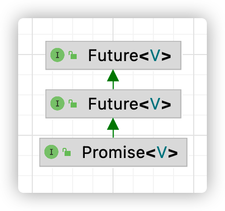

## Netty


### NIO 基础

- 同步：没有得到结果之前，该调用就不返回或继续执行后续操作

- 异步：调用者在没有得到结果之前，就可以继续执行后续操作。当这个调用完成后，一般通过状态、通知和回调来通知调用者。

- 阻塞：结果返回之前，当前线程会被挂起。调用线程只有在得到结果之后才会返回。

- 非阻塞：不能立刻得到结果之前，该调用不会阻塞当前线程。


non-blocking io 非阻塞io

- Channel 通道

  读写数据的双向通道 (可以从 channel 读，也可以写入 channel)

  - FileChannel 文件，工作在阻塞模式下
  - DatagramChannel udp编程
  - SocketChannel tcp编程
  - ServerSocketChannel tcp 服务器端

- Buffer 数据缓冲区

  - ByteBuffer

    ```java
    // 向缓冲区 buffer 中写入数据
    channel.read(buffer);
    // 将缓存区切换至读模式
    buffer.flip();
    // 读取缓冲区的数据
    buffer.get();
    // 将缓存区切换至写模式
    buffer.clear();
    // ... 重复读取
    ```

    不能被多个 Channel 共同使用，需要为每个 Channel 都配置一个独立的 buffer

  - Short/Int/Long/Float/Double/CharBuffer

- Selector

  多线程的问题：内存占用高；上下文切换成本高；适合连接数少的场景

  线程池问题：阻塞模式下只能处理一个 socket 连接；适合短连接场景

  Selector 使用一个线程管理多个 Channel，Channel 都工作在非阻塞模式下，适合连接数多流量低的场景


### 零拷贝

不需要将数据复制到 jvm 内存中

```java
ByteBuffer.allocate(32); // jvm 内存
ByteBuffer.allocateDirect(32); // 直接内存
```


### EventLoop

ChannelHandler 如何切换线程

```java
// io.netty.channel.AbstractChannelHandlerContext#invokeChannelRead(io.netty.channel.AbstractChannelHandlerContext, java.lang.Object)
static void invokeChannelRead(final AbstractChannelHandlerContext next, Object msg) {
    final Object m = next.pipeline.touch(ObjectUtil.checkNotNull(msg, "msg"), next);
    // 查找下一个 Handler 的 EventLoop
    EventExecutor executor = next.executor();

    // 当前 handler 的线程是不是和 executor 是同一个线程
    // 是的话直接执行
    if (executor.inEventLoop()) {
        next.invokeChannelRead(m);
    } else {
        // 如果不是，将要执行的代码作为任务提交给下一个handler的线程来处理
        executor.execute(new Runnable() {
            @Override
            public void run() {
                next.invokeChannelRead(m);
            }
        });
    }
}
```


### Channel

- close：关闭 channel
- closeFuture：处理 channel 关闭
  - sync 同步等待 channel 关闭
  - addListener 异步等待 channel 关闭
- pipeline：添加处理器
- write：写入数据
- writeAndFlush：写出数据并刷出


ChannelFuture


netty 通过异步提高了吞吐量，并没有缩短相应时间


### io.netty.util.concurrent.Future  &  io.netty.util.concurrent.Promise



- java.util.concurrent.Future **同步**等待任务结束才能得到结果
- io.netty.util.concurrent.Future **异步**等任务结束后得到结果
- io.netty.util.concurrent.Promise 脱离了独立任务存在，作为两个线程间传递结果的容器


| 方法        | jdk Future                         | netty Future                            | Promise      |
| ----------- | ---------------------------------- | --------------------------------------- | ------------ |
| cancel      | 取消任务                           |                                         |              |
| isCanceled  | 判断是否取消                       |                                         |              |
| isDone      | 判断任务是否完成，无法区分成功失败 |                                         |              |
| get         | 获取任务结果，阻塞等到             |                                         |              |
| getNow      |                                    | 获取结果，非阻塞，未产生结果是返回 null |              |
| await       |                                    | 等待任务结束，任务失败也不会抛异常      |              |
| sync        |                                    | 等待任务结束，任务失败抛异常            |              |
| isSuccess   |                                    | 判断是否成功                            |              |
| cause       |                                    | 获取失败信息，非阻塞，没有失败返回 null |              |
| addListener |                                    | 添加回调，异步接收结果                  |              |
| setSuccess  |                                    |                                         | 设置成功结果 |
| setFailure  |                                    |                                         | 设置失败结果 |


### Handler & Pipeline

Handler

- ChannelInboundHandler：处理入站数据
- ChannelOutboundHandler：处理出站数据
