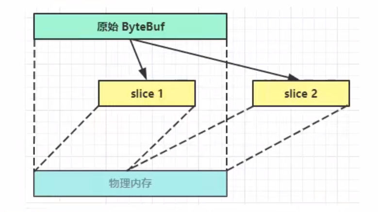

## Netty


### NIO 基础

- 同步：没有得到结果之前，该调用就不返回或继续执行后续操作

- 异步：调用者在没有得到结果之前，就可以继续执行后续操作。当这个调用完成后，一般通过状态、通知和回调来通知调用者。

- 阻塞：结果返回之前，当前线程会被挂起。调用线程只有在得到结果之后才会返回。

- 非阻塞：不能立刻得到结果之前，该调用不会阻塞当前线程。


non-blocking io 非阻塞io

- Channel 通道

  读写数据的双向通道 (可以从 channel 读，也可以写入 channel)

  - FileChannel 文件，工作在阻塞模式下
  - DatagramChannel udp编程
  - SocketChannel tcp编程
  - ServerSocketChannel tcp 服务器端

- Buffer 数据缓冲区

  - ByteBuffer

    ```java
    // 向缓冲区 buffer 中写入数据
    channel.read(buffer);
    // 将缓存区切换至读模式
    buffer.flip();
    // 读取缓冲区的数据
    buffer.get();
    // 将缓存区切换至写模式
    buffer.clear();
    // ... 重复读取
    ```

    不能被多个 Channel 共同使用，需要为每个 Channel 都配置一个独立的 buffer

  - Short/Int/Long/Float/Double/CharBuffer

- Selector

  多线程的问题：内存占用高；上下文切换成本高；适合连接数少的场景

  线程池问题：阻塞模式下只能处理一个 socket 连接；适合短连接场景

  Selector 使用一个线程管理多个 Channel，Channel 都工作在非阻塞模式下，适合连接数多流量低的场景


### 零拷贝

不需要将数据复制到 jvm 内存中

```java
ByteBuffer.allocate(32); // jvm 内存
ByteBuffer.allocateDirect(32); // 直接内存
```


### EventLoop

ChannelHandler 如何切换线程

```java
// io.netty.channel.AbstractChannelHandlerContext#invokeChannelRead(io.netty.channel.AbstractChannelHandlerContext, java.lang.Object)
static void invokeChannelRead(final AbstractChannelHandlerContext next, Object msg) {
    final Object m = next.pipeline.touch(ObjectUtil.checkNotNull(msg, "msg"), next);
    // 查找下一个 Handler 的 EventLoop
    EventExecutor executor = next.executor();

    // 当前 handler 的线程是不是和 executor 是同一个线程
    // 是的话直接执行
    if (executor.inEventLoop()) {
        next.invokeChannelRead(m);
    } else {
        // 如果不是，将要执行的代码作为任务提交给下一个handler的线程来处理
        executor.execute(new Runnable() {
            @Override
            public void run() {
                next.invokeChannelRead(m);
            }
        });
    }
}
```


### Channel

- close：关闭 channel
- closeFuture：处理 channel 关闭
  - sync 同步等待 channel 关闭
  - addListener 异步等待 channel 关闭
- pipeline：添加处理器
- write：写入数据
- writeAndFlush：写出数据并刷出


ChannelFuture


netty 通过异步提高了吞吐量，并没有缩短相应时间


### io.netty.util.concurrent.Future  &  io.netty.util.concurrent.Promise


- java.util.concurrent.Future **同步**等待任务结束才能得到结果
- io.netty.util.concurrent.Future **异步**等任务结束后得到结果
- io.netty.util.concurrent.Promise 脱离了独立任务存在，作为两个线程间传递结果的容器


| 方法        | jdk Future                         | netty Future                            | Promise      |
| ----------- | ---------------------------------- | --------------------------------------- | ------------ |
| cancel      | 取消任务                           |                                         |              |
| isCanceled  | 判断是否取消                       |                                         |              |
| isDone      | 判断任务是否完成，无法区分成功失败 |                                         |              |
| get         | 获取任务结果，阻塞等到             |                                         |              |
| getNow      |                                    | 获取结果，非阻塞，未产生结果是返回 null |              |
| await       |                                    | 等待任务结束，任务失败也不会抛异常      |              |
| sync        |                                    | 等待任务结束，任务失败抛异常            |              |
| isSuccess   |                                    | 判断是否成功                            |              |
| cause       |                                    | 获取失败信息，非阻塞，没有失败返回 null |              |
| addListener |                                    | 添加回调，异步接收结果                  |              |
| setSuccess  |                                    |                                         | 设置成功结果 |
| setFailure  |                                    |                                         | 设置失败结果 |


### Handler & Pipeline

Handler

- ChannelInboundHandler：处理入站数据
- ChannelOutboundHandler：处理出站数据


### ByteBuf

- 池化技术进行重用
- 读写指针分离，不需要切换读写模式
- 自动扩容
- 支持链式调用
- 零拷贝

默认使用池化技术进行重用，如果不需要可以配置虚拟机参数

```java
-Dio.netty.allocator.type=polled
```

```java
 // 会自动扩容 (默认为 256)
ByteBuf buffer = ByteBufAllocator.DEFAULT.buffer(32);
buffer.writeBytes("a".repeat(300).getBytes());
```

直接内存(默认) 和 堆内存

```java
ByteBuf heapBuffer = ByteBufAllocator.DEFAULT.heapBuffer(32);
ByteBuf directBuffer = ByteBufAllocator.DEFAULT.directBuffer(32);
```

**完全使用完(最后一个使用 handler(头尾默认会释放))**某个 ByteBuf 之后，调整其引用计数。否则会产生资源泄漏

```java
// io.netty.channel.DefaultChannelPipeline.TailContext 一个入站处理器
// channelRead 方法中进行释放(判断类型是不是 ReferenceCounted 是的话进行释放，否则说明已经将数据转换成了其他类型，不需要释放)

// io.netty.channel.DefaultChannelPipeline.HeadContext 一个 入站 + 出站 处理器
/// write 方法中释放 ( TODO 这里有一个出站缓冲区)
```


零拷贝

- 文件 channel 向 socket channel 传输数据时不经过java内存，直接从文件走到 socket，减少内存复制

- 对 ByteBuf 进行切片(slice)，没有进行内存复制，切片有自己的读写指针
- 对 ByteBuf 进行组合(Composite)，没有进行内存复制，有自己的读写指针
- Unpooled 一个工具类




### 进阶操作

- 基于分隔符

  - DelimiterBasedFrameDecoder：使用用户自定义的分隔符提起帧

  - LineBasedFrameDecoder：         使用行尾符(\n\r)分隔

- 基于长度

  - FixedLengthFrameDecoder：            在构造函数中指定帧长度

  - LengthFieldBasedFrameDecoder：  根据编码进帧头部的长度值提取帧

    - maxFrameLength - 发送的数据包最大长度；

    - lengthFieldOffset - 长度域偏移量，指的是长度域位于整个数据包字节数组中的下标；

    - lengthFieldLength - 长度域的自己的字节数长度。

    - lengthAdjustment – 长度域的偏移量矫正。 如果长度域的值，除了包含有效数据域的长度外，还包含了其他域（如长度域自身）长度，那么，就需要进行矫正。矫正的值为：包长 - 长度域的值 – 长度域偏移 – 长度域长。

    - initialBytesToStrip – 丢弃的起始字节数。丢弃处于有效数据前面的字节数量。比如前面有4个节点的长度域，则它的值为4。


### 协议设计与解析

魔数，版本号，序列化算法，指令类型，请求序号，正文长度，正文内容

redis 的协议：

```
*3\r\n  #消息一共有三行
$3\r\n #第一行有长度为3
set\r\n #第一行的消息
$4\r\n  #第二行长度为4
name\r\n #第二行的消息
$6\r\n #第三行长度为6
123456\r\n #第三行的消息
+OK\r\n #操作成功
```

http 协议：HttpServerCodec 处理


ChannelHandler 如果没有中间状态，可以在 EventLoopGroup 之间共享，代码证通过 @Sharable 注解标识是否可以共享 (解码器一般不能共享)


### 参数

1. connect_timeout_mills

   SocketChannel 参数

   客户端建立连接后，指定时间内无法连接则抛出异常

   SO_TIMEOUT 用于阻塞io，accept, read 等是无限等待的，如果不希望无限等待使用该参数

   netty 是非阻塞的

   通过定时任务来完成 Promise


2. SO_BACKLOG

   - 半连接队列 (sync queue)：/proc/sys/net/ipv4/tcp_max_syn_backlog 文件指定
   - 全连接队列 (accept queue)：/proc/sys/net/core/somaxconn 指定；如果该队列满了，server 将发送一个拒绝错误到 client；同时指定取较小值

   ```java
   // java.nio.channels.ServerSocketChannel#bind 方法中赋值 backlog
   //给的默认值：
   // io.netty.channel.socket.ServerSocketChannelConfig
   // io.netty.channel.socket.DefaultServerSocketChannelConfig
   
   int somaxconn = PlatformDependent.isWindows() ? 200 : 128;
   ```


3. ulimit -n

   操作系统参数，一个进程允许打开的文件描述符的数量

4. tcp_nodelay

   控制是否开启Nagle算法

5. so_sendbuf  和  so_recvbuf

   TCP 发送/接受 缓冲区的 容量上限

6. allocator

   分配 ByteBuf

   ctx.alloc()  -> 默认 PooledUnsafeDirectBytebuf 256；可以通过虚拟机参数进行修改

   - -Dio.netty.allocator.type=unpooled 不使用池化
   - -Dio.netty.noPreferDirect=true 使用堆内存(不使用直接内存)

7. rcvbuf_allocator

   控制 netty 接收缓冲区(第一个 handler 的ByteBuf 大小类型)大小，可以动态调整，统一使用直接内存，池化由参数控制

   

   ByteBufAllocator 决定是否池化 (可以通过参数修改)；通过 RecvByteBufAllocator.handler#allocate 创建 (是 direct 直接内存)


### RPC 调用


### 源码分析

```java
// 原生 nio 操作
//1 netty 中使用 NioEventLoopGroup （简称 nio boss 线程）来封装线程和 selector (选择器)
Selector selector = Selector.open();
  
//2 创建 NioServerSocketChannel，同时会初始化它关联的 handler，以及为原生 ssc 存储 config
io.netty.channel.socket.nio.NioServerSocketChannel attachment = new NioserverSocketChannel();

//3 创建 NioServerSocketchannel 时，创建了 java 原生的 Server Socketchannel
java.nio.channels.ServerSocketChannel serverSocketChannel = ServerSocketChannel.open();

public static ServerSocketChannel open() throws IOException {
    return SelectorProvider.provider().openServerSocketChannel();
}

// 设置为非阻塞模式
serverSocketChannel.configureBlocking(false);
  
//4 启动 nio boss 线程执行接下来的操作
//5 注册（仅关联 Selector 和 NioServerSocketChannel)，未关注事件
SelectionKey selectionKey = serverSocketChannel.register(selector, 0, attachment);
  
//6 head ->初始化器 -> ServerBootstrapAcceptor -＞ tail，初始化器是一次性的，只为添加 acceptor
//7 绑定端口
serverSocketchannel.bind(new InetSocketAddress(8080));
  
//8 触发 channel active 事件，在 head 中关注 op_accept 事件
selectionkey.interestOps(Selectionkey.OP_ACCEPT);
```

```java
// io.netty.bootstrap.AbstractBootstrap#bind(int)

// io.netty.bootstrap.AbstractBootstrap#initAndRegister
init (main)
  创建 io.netty.channel.socket.nio.NioServerSocketChannel (和上面类似 provider.openServerSocketChannel())
  添加 NioServerSocketChannel 初始化handler (添加一个 ChannelInitializer，注册之后才会调用它的 initChannel 方法)
  初始化 handler 等待调用  (nio-thread)
  向 nio ssc 添加 ServerBootstrapAcceptor(accept 事件发生后建立连接)

register (切换线程，让执行权从主线程 切换到 nio线程)
  启动 nio master 线程 (main)
  原生 ssc 注册到 selector 还没有关注事件 (和上面类似 serverSocketChannel.register(selector, 0, attachment)) (nio-thread)
  执行 NioServerSocketChannel 调用 ChannelInitializer#initChannel 方法 (nio-thread)

regFuture 回调 doBind0 (nio-thread)
  原生 ServerSocketChannel 绑定 (serverSocketchannel.bind(new InetSocketAddress(8080));) (nio-thread)
  触发 NioServerSocketChannel active 事件 (selectionkey.interestOps(Selectionkey.OP_ACCEPT) (在 io.netty.channel.nio.AbstractNioChannel#doBeginRead 中)) (nio-thread)


```

