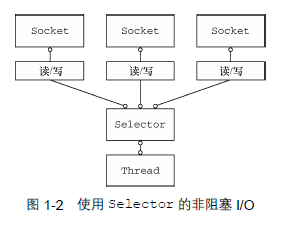
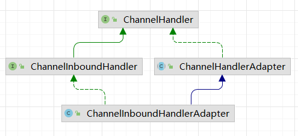
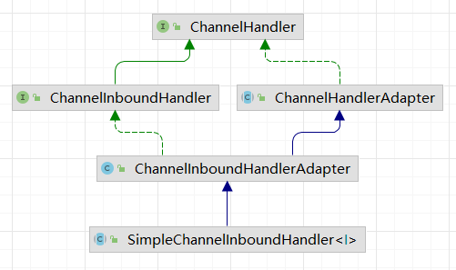
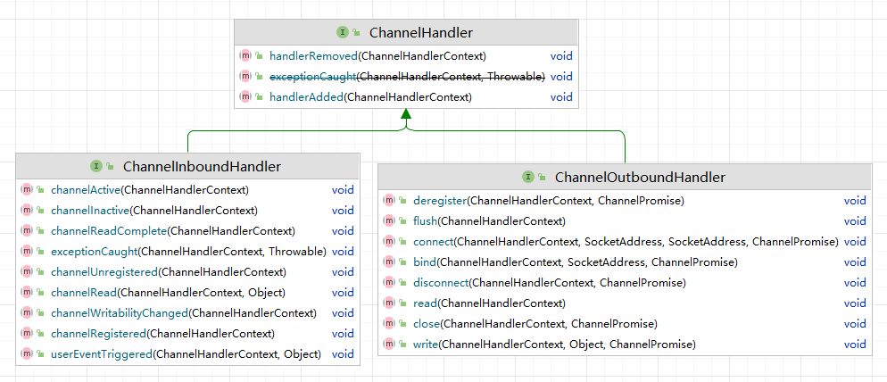
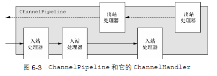
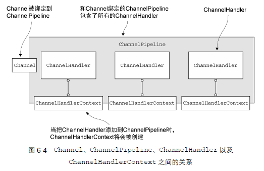
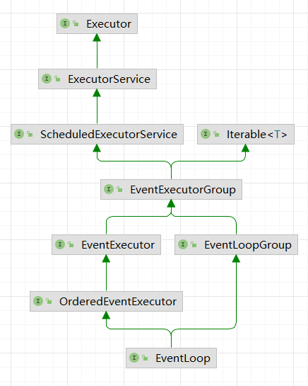

### Netty

#### 1. 异步 和 事件驱动

NIO



Netty 通过触发事件将 Selector 从应用程序中抽象出来，消除了本来需要手动编写的派发代码。在内部，为每个 Channel 分配一个 EventLoop(本身由一个线程驱动，无需考虑同步问题)，用来处理所有的事件

netty 的**核心组件**

- Channel

  可以看作是传入 或 传出 数据的载体，可以被打开或关闭

- 回调

  操作完成后通知相关方

- Future

  ChannelFuture 异步操作结果的占位符

  ChannelFutureListener 监听操作是否完成，完成后调用，避免了手动检查操作是否完成

- 事件 和 ChannelHandler

  基于已发生的事件触发适当的动作

    - 入站事件：李恩杰已被激活或连接失活，数据读取，用户事件，错误事件
    - 出站事件：打开或关闭到远程节点的连接，将数据写入套接字

  入站事件 -> 入站处理器

  出站事件 -> 出站处理器

  ChannelHandler 处理器的基本抽象

#### 2. 应用实例

**服务端**

1. ChannelHandler 和 业务逻辑

    - 针对不同类型的事件调用 ChannelHandler
    - 应用程序通过实现 或 扩展 ChannelHandler 来挂钩到事件的生命周期，提供自定义的应用程序逻辑
    - 架构上，ChannelHandler 有助于报错业务逻辑 和 网络处理代码 的分离。简化了开发过程



**客户端**




#### 3. netty 组件 和 设计


##### 3.1 Channel, EventLoop, ChannelFuture

- Channel: Socket

  基本 IO 操作：bind, connect, read, write

  Channel 接口提供的 api 简化 java 原生 Socket 的复杂性


- EventLoop: 控制流，多线程处理，并发

  定义 Netty 的核心抽象，处理连接的生命周期中发生的事件

  一个给定 Channel 的所有 IO 操作全部都由一个 Thread 执行

  - 一个 EventLoopGroup 包含一个或者多个 EventLoop；
  
  - 一个 EventLoop 在它的生命周期内只和一个 Thread 绑定；
  
  - 所有由 EventLoop 处理的 I/O 事件都将在它专有的 Thread 上被处理；
  
  - 一个 Channel 在它的生命周期内只注册于一个 EventLoop；
  
  - 一个 EventLoop 可能会被分配给一个或多个 Channel。
  
    


- ChannelFuture: 异步通知

  对于异步操作，在特定的时间段确定其结果


##### 3.2 ChannelHandler, ChannelPipeline

- ChannelHandler

  处理出站 和 入站 数据的应用程序逻辑的容器

  ChannelInboundHandler: 接收入站事件和数据

- ChannelPipeline

  提供了 ChannelHandler 链的容器，并定义了用于该链上传播入站 和 出站 时间流的 api。Channel 被创建时，会自动分派到专属的 Pipeline

  ChannelPipeline 是 ChannelHandler 的编排顺序，使事件流经 ChannelPipeline 是 ChannelHandler 的工作

  将 ChannelHandler 安装到 ChannelPipeline 的过程：

  - 一个 ChannelInitializer 的实现被注册到 ServerBootstrap
  - 当 ChannelInitializer#initChannel 被调用时，ChannelInitializer 将在 ChannelPipeline 中安装一组自定义的 ChannelHandler
  - ChannelInitializer 将自己从 ChannelPipeline 中移除

ChannelHandler 被添加到 ChannelPipeline 时，会被分配一个 ChannelHandlerContext

ChannelHandlerAdapter 作为 ChannelHandler 的默认实现，可以只重写需要的方法 或 事件


- 编码器 / 解码器

  发送 或 接收消息时，可能需要进行数据转换

  从入站 Channel 中读取消息时，ChannelInBoundHandler#channelRead 方法会被调用

  扩展 SimpleChannelInBoundHandler<T>  完成解码


**引导**

- Bootstrap: 用于客户端，连接到远程主机端口，需要一个 EventLoopGroup
- ServerBootstrap: 用于服务端，绑定到一个本地端口，需要两个 EventLoopGroup
  - 第一个只包含一个 ServerChannel，代表服务器自身的已绑定到某个本地端口的正在监听的台阶在
  - 第二个将包含所有已创建的用来处理传入客户端连接(每个服务器已接受的连接都有一个)的 Channel


#### 4. 传输

每个 Channel 都被被分配一个 ChannelPipeline 和 ChannelConfig(包含该 Channel 的所有配置)

ChannelPipeline 持有所有 ChannelHandler(应用与入站 和 出站数据 和 事件)

- 转换数据格式
- 提供异常通知
- 提供 Channel 变成获得 或 非活动的通知
- 提供 Channel 注册 或 注销 到 EventLoop 的通知
- 提供用户自定义事件的通知

内置的传输

- NIO: 基于选择器(java.nio.channels)

  所有 IO 操作的全异步实现，可以请求在 Channel 状态发生变化时得到通知

  - OP_ACCEPT:          新 Channel 被接受并就绪
  - OP_CONNECT:      Channel 连接已完成
  - OP_READ:              Channel 有已就绪的可供读取的数据
  - OP_WRITE:             Channel 可用于写数据

- Epoll: netty 特有的实现，更加适配 netty 现有的线程模型

  用于 linux 的本地非阻塞传输

- OIO: 使用阻塞流(java.net)

- Local: 可在 JVM 内部通过管道进行通信的本地传输

  用于在同一个 JVM 中运行的客户端 和 服务器程序之间的异步通信

- Embedded: 用于测试 ChannelHandler

  可以将一组 ChannelHandler 作为帮助器嵌入到其他的 ChannelHandler 内部(可以扩展其功能而不用修改内部代码)

  

#### 5. ByteBuf 数据容器

java.nio.ByteBuffer -> io.netty.buffer.ByteBuf

1. 工作原理

   维护两个索引(读取，写入)

2. 使用模式

   - 堆缓冲区

     支撑数组(backing array)

   - 直接缓冲区

   - 复合缓冲区

     `io.netty.buffer.CompositeByteBuf` 提供一个将多个缓冲区表示为单个合并缓冲区的虚拟表示


字节级操作

- 随机访问索引

  ```java
  buf.getByte(i)
  ```

- 顺序访问索引

  通过 读索引，写索引 将数据划分为三个区域

- 可丢弃字节

  discardReadBytes 方法丢弃已经读过的数据，会导致内存复制(需要将可读字节移动到缓冲区的开始位置)

- 可读字节

- 可写字节

- 索引管理

  markReaderIndex, markWriteIndex, resetWriteIndex, resetReadIndex, clear

- 查找操作

  确定索引 indexOf

  io.netty.util.ByteProcessor

- 派生缓冲区

  展示内容视图，返回新的 ByteBuf，具有自己的读索引，写索引，标记索引。会修改原数据

- 读写操作
  - get / set 不修改索引
  - read / write 修改索引


ByteBufHolder 接口

记录实际的数据 + 一些属性值


ByteBuf 分配

- 按需分配 ByteBufAllocator 接口，池化
- Unpooled 缓冲区：创建未池化的 ByteBuf 实例
- ByteBufUtil


引用计数


#### 6. ChannelHandler 和 ChannelPipeline


##### 6.1 ChannelHandler

- Channel 生命周期

  - ChannelUnregistered：  Channel 已创建，还未注册到 EveltLoop
  - ChannelRegistered：      Channel 已被注册到 EventLoop
  - ChannelActive：              Channel 处于活动状态，可以接收发送数据
  - ChannelInactive：           Channel 没有连接到远程节点

  Channel 的状态发生改变时，会生成对应的事件，转发给 ChannelPipeline 中的 ChannelHandler 对其进行响应

  

- ChannelHandler 生命周期

  - handlerAdded：      当把 ChannelHandler 添加到 ChannelPipeline 中时被调用
  - handlerRemoved： 当把 ChannelHandler 从 ChannelPipeline 中移除时调用
  - exceptionCaught：  处理过程中 ChannelPipeline 发生异常时调用

  两个子接口

  - ChannelInboundHandler：   处理入站数据以及各种状态变化

  - ChannelOutboundHandler：处理出站数据运行拦截所有操作

    可以按需推迟操作 或 事件

    

    

    

    对应的适配器提供了基本实现，可以通过继承重写一些方法

- 资源管理

  完全使用完某个 ByteBuf 之后，调整其引用计数。否则会产生资源泄漏

  可以开启泄漏检测 `java -Dio.netty.leakDetectionLevel=ADVANCED`


##### 6.2 ChannelPipeline

每一个新创建的 Channel 都将会被分配一个新的 ChannelPipeline。这项关联是永久性的；Channel 既不能附加另外一个 ChannelPipeline，也不能分离其当前的。

事件将会被 ChannelInboundHandler 或者 ChannelOutboundHandler处理。随后，通过调用 ChannelHandlerContext 实现，它将被转发给同一超类型的下一个 ChannelHandler。

ChannelHandlerContext 使得 ChannelHandler 能够和它的 ChannelPipeline 以及其他的 ChannelHandler 交互。ChannelHandler 可以通知其所属的 ChannelPipeline 中的下一个 ChannelHandler，甚至可以动态修改它所属的 ChannelPipeline



ChannelPipeline 传播事件时，会测试下一个是否与事件运动方向相匹配，不匹配的会被跳过

ChannelHandler 的阻塞 与 执行


通过触发事件调用下一个 ChannelHandler 的入站 或 出站事件


##### 6.3 ChannelHandlerContext 接口

每当有 ChannelHandler 添加到 ChannelPipeline 中时，都会创建 ChannelHandlerContext。

ChannelHandlerContext 的主要功能是管理它所关联的 ChannelHandler 和在同一个 ChannelPipeline 中的其他 ChannelHandler 之间的交互。

ChannelHandlerContext 中有一些存在于 Channel 和 ChannelPipeline 中的方法

- 如果调用 Channel 或 ChannelPipeline 中的方法，将沿着整个 ChannelPipeline 进行传播
- 如果调用 ChannelHandlerContext 中的方法，将从所关联的 ChannelHandler 开始，只传播之后的 ChannelPipeline 中能处理该事件的 ChannelHandler



在多个ChannelPipeline中安装同一个ChannelHandler 的一个常见的原因是用于收集跨越多个 Channel 的统计信息。ChannelHandler 需要添加 @Sharable 注解并且是线程安全的，否则被添加到多个 ChannelPipeline 时会触发异常


##### 6.4 异常处理

- 入站异常

  异常抛出后，将从触发的位置开始流经 ChannelPipeline // TODO 是不是整条链

  到 pipelines 尾端后如果没被处理，会被标记

- 出站异常

  1. 每个出站操作都返回一个 ChannelFuture，注册到其中的 ChannelFutureListener 将在操作完成时被通知操作是否成功
  2. ChannelOutboundHandler 方法中通过 ChannelPromise 参数注册监听器


#### 7. EventLoop 和 线程模型


##### 7.1 线程模型概述

池化 + 线程池


##### 7.2 EventLoop 接口

定义 Netty 的核心抽象，处理连接的生命周期中发生的事件

一个给定 Channel 的所有 IO 操作全部都由一个 Thread 执行

- 一个 EventLoopGroup 包含一个或者多个 EventLoop；
- 一个 EventLoop 在它的生命周期内只**和一个 Thread 绑定**；
- 所有由 EventLoop 处理的 I/O 事件都将在它专有的 Thread 上被处理；
- 一个 Channel 在它的生命周期内只注册于一个 EventLoop；
- 一个 EventLoop 可能会被**分配给一个或多个 Channel**。




Netty4 中的 IO 和 事件处理 都分配给 EventLoop 的那个 Thread 处理


##### 7.3 任务调度

EventLoop 实现了 ScheduledExecutorService 接口

```java
Channel channel = CHANNEL_FROM_SOMEWHERE;
ScheduledFuture<?> future = channel.eventLoop().scheduleAtFixedRate(() -> {
    System.out.println("run every 10s");
}, 10, 10, TimeUnit.SECONDS);

// 终止操作
future.cancel(true);
```


##### 7.4 实现细节


