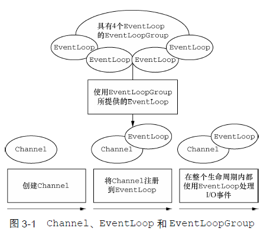
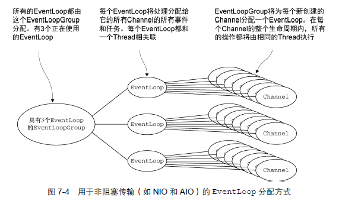
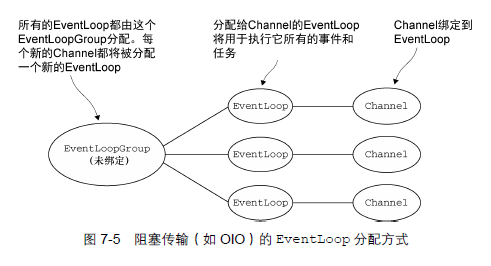
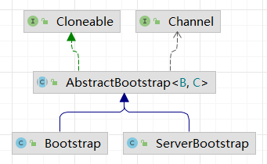
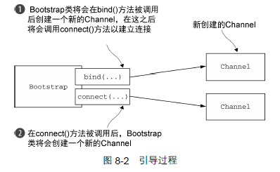
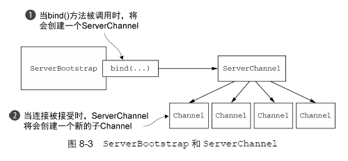
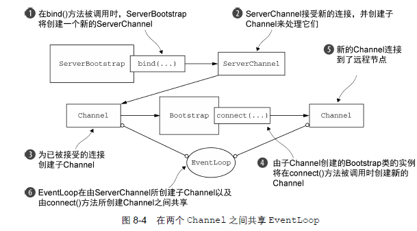
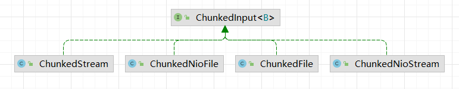
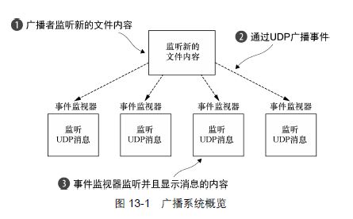
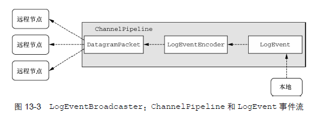

### Netty

#### 1. 异步 和 事件驱动

NIO


- 非阻塞网络调用使得我们可以不必等待一个操作的完成。 完全异步的I/O 正是基于这个特性构建的，并且更进一步: 异步方法会立即返回，并且在它完成时，会直接或者在稍后的某个时间点通知用户。
- 选择器使得我们能够通过较少的线程便可监视许多连接上的事件。


Netty 通过触发事件将 Selector 从应用程序中抽象出来，消除了本来需要手动编写的派发代码。在内部，为每个 Channel 分配一个 EventLoop(本身由一个线程驱动，无需考虑同步问题)，用来处理所有的事件

netty 的**核心组件**

- Channel

  可以看作是传入 或 传出 数据的载体，可以被打开或关闭

- 回调

  操作完成后通知相关方

- Future

  它将在未来的某个时刻完成，并提供对其结果的访问

  ChannelFuture 异步操作结果的占位符

  ChannelFutureListener 监听操作是否完成，完成后调用，**避免了手动检查**操作是否完成

- 事件 和 ChannelHandler

  基于已发生的事件触发适当的动作

    - 入站事件：连接已被激活或连接失活，数据读取，用户事件，错误事件
    - 出站事件：打开或关闭到远程节点的连接，将数据写入套接字

  入站事件 -> 入站处理器

  出站事件 -> 出站处理器

  ChannelHandler 处理器的基本抽象
  
- EventLoop

  EventLoop 本身只由一个线程驱动，其处理了一个 Channel 的所有I/O 事件，并且在该 EventLoop 的整个生命周期内都不会改变。这个设计消除了在 ChannelHandler 实现中需要进行同步的任何顾虑


#### 2. 应用实例

**服务端**

1. ChannelHandler 和 业务逻辑

    - 针对不同类型的事件调用 ChannelHandler
    - 应用程序通过实现 或 扩展 ChannelHandler 来挂钩到事件的生命周期，提供自定义的应用程序逻辑
    - 架构上，ChannelHandler 有助于报错业务逻辑 和 网络处理代码 的分离。简化了开发过程

每个 Channel 都拥有一个与之相关联的 ChannelPipeline,其持有一个 ChannelHandler 的实例链。在默认的情况下，ChannelHandler 会把对它的方法的调用转发给链中的下一个 ChannelHandler。因此，如果exceptionCaught() 方法没有被该链中的某处实现，那么所接收的异常将会被传递到ChannelPipeline 的尾端并被记录。为此，应用程序应该提供至少有一个实现了 exceptionCaught() 方法的 ChannelHandler


**客户端**


#### 3. netty 组件 和 设计


##### 3.1 Channel, EventLoop, ChannelFuture

- Channel: Socket

  基本 IO 操作：bind, connect, read, write

  Channel 接口提供的 api 简化 java 原生 Socket 的复杂性


- EventLoop: 控制流，多线程处理，并发

  定义 Netty 的核心抽象，处理连接的生命周期中发生的事件

  一个给定 Channel 的所有 IO 操作全部都由一个 Thread 执行

  - 一个 EventLoopGroup 包含一个或者多个 EventLoop；
  
  - 一个 EventLoop 在它的生命周期内只和一个 Thread 绑定；
  
  - 所有由 EventLoop 处理的 I/O 事件都将在它专有的 Thread 上被处理；
  
  - 一个 Channel 在它的生命周期内只注册于一个 EventLoop；
  
  - 一个 EventLoop 可能会被分配给一个或多个 Channel。
  
    


- ChannelFuture: 异步通知

  对于异步操作，在之后特定的时间点确定其结果
  
  通过 addListener 注册 ChannelFutureListener 完成


##### 3.2 ChannelHandler, ChannelPipeline

- ChannelHandler

  处理出站 和 入站 数据的应用程序逻辑的容器

  ChannelInboundHandler: 接收入站事件和数据

- ChannelPipeline

  提供了 ChannelHandler 链的容器，并定义了用于该链上传播入站 和 出站 事件流的 api。Channel 被创建时，会自动分派到专属的 Pipeline

  ChannelPipeline 是 ChannelHandler 的编排顺序，使事件流经 ChannelPipeline 是 ChannelHandler 的工作

  将 ChannelHandler 安装到 ChannelPipeline 的过程：

  - 一个 ChannelInitializer 的实现被注册到 ServerBootstrap
  - 当 ChannelInitializer#initChannel 被调用时，ChannelInitializer 将在 ChannelPipeline 中安装一组自定义的 ChannelHandler
  - ChannelInitializer 将自己从 ChannelPipeline 中移除

ChannelHandler 被添加到 ChannelPipeline 时，会被分配一个 ChannelHandlerContext

ChannelHandlerAdapter 作为 ChannelHandler 的默认实现，可以只重写需要的方法 或 事件


在Netty中,有两种发送消息的方式

- 写到 Channel 中：方式将会导致消息从ChannelPipeline的尾端开始流动
- 写到和 ChannelHandler 相关联的 ChannelHandlerContext 对象中：导致消息从 ChannelPipeline 中的下一个 ChannelHandler 开始流动。


- 编码器 / 解码器

  发送 或 接收消息时，可能需要进行数据转换

  从入站 Channel 中读取消息时，ChannelInBoundHandler#channelRead 方法会被调用

  扩展 SimpleChannelInBoundHandler<T>  完成解码


**引导**

- Bootstrap: 用于客户端，连接到远程主机端口，需要一个 EventLoopGroup
- ServerBootstrap: 用于服务端，绑定到一个本地端口，需要两个 EventLoopGroup
  - 第一个只包含一个 ServerChannel，代表服务器自身的已绑定到某个本地端口的正在监听的套接字
  - 第二个将包含所有已创建的用来处理传入客户端连接(每个服d务器已接受的连接都有一个)的 Channel

与 ServerChannel 相关联的 EventLoopGroup 将分配-一个负责为传入连接请求创建 Channel 的 EventLoop。一但连接被接受，第二个 EventLoopGroup 就会给它的 Channel 分配一个 EventLoop。


#### 4. 传输

每个 Channel 都被被分配一个 ChannelPipeline 和 ChannelConfig(包含该 Channel 的所有配置)

ChannelPipeline 持有所有 ChannelHandler(应用入站 和 出站数据 和 事件)

- 转换数据格式
- 提供异常通知
- 提供 Channel 变成活动 或 非活动的通知
- 提供 Channel 注册 或 注销 到 EventLoop 的通知
- 提供用户自定义事件的通知

内置的传输

- NIO: 基于选择器(java.nio.channels)

  选择器运行在-一个检查状态变化并对其做出相应响应的线程上,在应用程序对状态的改变做出响应之后，选择器将会被重置，并将重复这个过程。

  所有 IO 操作的全异步实现，可以请求在 Channel 状态发生变化时得到通知

  - OP_ACCEPT:          新 Channel 被接受并就绪
  - OP_CONNECT:      Channel 连接已完成
  - OP_READ:              Channel 有已就绪的可供读取的数据
  - OP_WRITE:             Channel 可用于写数据

- Epoll: netty 特有的实现，更加适配 netty 现有的线程模型

  用于 linux 的本地非阻塞传输

- OIO: 使用阻塞流(java.net)

- Local: 可在 JVM 内部通过管道进行通信的本地传输

  用于在同一个 JVM 中运行的客户端 和 服务器程序之间的异步通信

- Embedded: 用于测试 ChannelHandler

  可以将一组 ChannelHandler 作为帮助器嵌入到其他的 ChannelHandler 内部(可以扩展其功能而不用修改内部代码)

  

#### 5. ByteBuf 数据容器

java.nio.ByteBuffer -> io.netty.buffer.ByteBuf

- 它可以被用户自定义的缓冲区类型扩展;

- 通过内置的复合缓冲区类型实现了透明的零拷贝;

- 容量可以按需增长(类似于JDK的 StringBuilder );

- 在读和写这两种模式之间切换不需要调用 ByteBuffer 的 flip() 方法;

- 读和写使用了不同的索引;

- 支持方法的链式调用;

- 支持引用计数;

- 支持池化。


1. 工作原理

   维护两个索引(读取，写入)

2. 使用模式

   - 堆缓冲区：支撑数组(backing array)，数据存储在 jvm 的堆中，在没有使用池化的情况下提供快速的分配和释放

   - 直接缓冲区：避免在每次调用本地I/O操作之前(或者之后)将缓冲区的内容复制到一个中间缓冲区( 或者从中间缓冲区把内容复制到缓冲区)。

   - 复合缓冲区

     `io.netty.buffer.CompositeByteBuf` 提供一个将多个缓冲区表示为单个合并缓冲区的虚拟表示


字节级操作

- 随机访问索引

  ```java
  buf.getByte(i)
  ```

- 顺序访问索引

  

  通过 读索引，写索引 将数据划分为三个区域

- 可丢弃字节 / 可读字节 / 可写字节

  discardReadBytes 方法丢弃已经读过的数据，会导致内存复制(需要将可读字节移动到缓冲区的开始位置)

- 索引管理

  markReaderIndex, markWriteIndex, resetWriteIndex, resetReadIndex, clear(读写索引都设为0)

- 查找操作

  确定索引 indexOf；可以通过 `io.netty.util.ByteProcessor` 进行复杂查询

- 派生缓冲区

  展示内容视图，返回新的 ByteBuf，具有自己的读索引，写索引，标记索引。会修改原数据

- 读写操作
  - get / set 不修改索引
  - read / write 修改索引


ByteBufHolder 接口

记录实际的数据 + 一些属性值


ByteBuf 分配

- 按需分配 ByteBufAllocator 接口，池化

  基于 堆/直接内存 的，CompositeBuf 组合的；可以通过Channel#alloc 或 ChannelHandlerContext#alloc 获取

- Unpooled 缓冲区：创建未池化的 ByteBuf 实例

- ByteBufUtil


引用计数

netty 为 ByteBuf 和 ByteByfHolder 引入了引用计数


#### 6. ChannelHandler 和 ChannelPipeline


##### 6.1 ChannelHandler

- Channel 生命周期

  - ChannelUnregistered：  Channel 已创建，还未注册到 EventLoop
  - ChannelRegistered：      Channel 已被注册到 EventLoop
  - ChannelActive：              Channel 处于活动状态(已经连接到远程节点)，可以接收发送数据
  - ChannelInactive：           Channel 没有连接到远程节点

  Channel 的状态发生改变时，会生成对应的事件，转发给 ChannelPipeline 中的 ChannelHandler 对其进行响应

  

- ChannelHandler 生命周期

  - handlerAdded：      当把 ChannelHandler 添加到 ChannelPipeline 中时被调用
  - handlerRemoved： 当把 ChannelHandler 从 ChannelPipeline 中移除时调用
  - exceptionCaught：  处理过程中 ChannelPipeline 发生异常时调用

  两个子接口 和 对应的适配器

  - ChannelInboundHandler(Adapter)：   处理入站数据以及各种状态变化

    与 Channel 生命周期相关；重写 channelRead 方法时，需要显式的释放与池化的 ByteBuf 实例相关的内存 (SimpleChannelInboundHandler 会在 channelRead0 方法消费后自动释放资源)

  - ChannelOutboundHandler(Adapter)：处理出站数据运行拦截所有操作

    可以按需推迟操作 或 事件 (ChannelPromise, ChannelFuture)

    ```java
    // 在出站方向这边，如果处理了write()操作并丢弃了一个消息，那么也应该负责释放它；
    // 不仅要释放资源，还要通知 ChannelPromise。 否则可能会出现 ChannelFutureListener 收不到某个消息已经被处理了的通知的情况。
    // 总之，如果一个消息被消费或者丢弃了，并且没有传递给 ChannelPipeline 中的下一个 Channe lOutboundHandler ,那么用户就有责任调用 ReferenceCountUtil.release()。
    // 如果消息到达了实际的传输层,那么当它被写人时或者 Channel 关闭时，都将被自动释放。
    @ChannelHandler.Sharable
    class DiscardOutboundHandler extends ChannelOutboundHandlerAdapter {
    
        @Override
        public void write(ChannelHandlerContext ctx, Object msg, ChannelPromise promise) throws Exception {
            // 释放资源
            // 如果消息被消费 或 被丢弃了，没有传递给 ChannelPipeline 中的下一个 ChannelOutboundHandler，用户需要调用 release 方法
            // 如果消息达到了实际的传输层，当它被写入或 Channel 关闭时，会被自动释放
            ReferenceCountUtil.release(msg);
            // 通知 ChannelPromise 数据已经被处理了
            promise.setSuccess();
        }
    }
    ```
    
    


- 资源管理

  完全使用完某个 ByteBuf 之后，调整其引用计数。否则会产生资源泄漏

  可以开启泄漏检测 `java -Dio.netty.leakDetectionLevel=ADVANCED`


##### 6.2 ChannelPipeline

每一个新创建的 Channel 都将会被分配一个新的 ChannelPipeline。这项关联是永久性的；Channel 既不能附加另外一个 ChannelPipeline，也不能分离其当前的。

事件将会被 ChannelInboundHandler 或者 ChannelOutboundHandler处理。随后，通过调用 ChannelHandlerContext 实现，它将被转发给同一超类型的下一个 ChannelHandler。

ChannelHandlerContext 使得 ChannelHandler 能够和它的 ChannelPipeline 以及其他的 ChannelHandler 交互。ChannelHandler 可以通知其所属的 ChannelPipeline 中的下一个 ChannelHandler，甚至可以动态修改它所属的 ChannelPipeline (addLast, adFirst, remove...)


ChannelPipeline 传播事件时，会测试下一个是否与事件运动方向相匹配，不匹配的会被跳过


ChannelHandler 的阻塞 与 执行

通常 ChannelPipeline 中的每一个 ChannelHandler 都是通过它的 EventLoop( I/O线程)来处理传递给它的事件的。所以不要阻塞这个线程，因为这会对整体的 I/O 处理产生负面的影响。

如果需要阻塞使用 EventExecutorGroup，如果一个事件被传递给一个自定义的 EventExecutorGroup ,它将被包含在这个 EventExecutorGroup 中的某个 EventExecutor 所处理，从而被从该 Channel 本身的 EventLoop 中移除。对于这种用例，Netty 提供了一个叫 DefaultEventExecutorGroup 的默认实现。


可以通过触发事件调用 ChannelPipeline 中下一个 ChannelHandler 的入站 或 出站事件


##### 6.3 ChannelHandlerContext 接口

每当有 ChannelHandler 添加到 ChannelPipeline 中时，都会创建 ChannelHandlerContext。

ChannelHandlerContext 的主要功能是管理它所关联的 ChannelHandler 和在同一个 ChannelPipeline 中的其他 ChannelHandler 之间的交互。事件从一个 ChannelHandler 到下一个 ChannelHandler 的移动是由ChannelHandlerContext 上的调用完成的。

ChannelHandlerContext 中有一些存在于 Channel 和 ChannelPipeline 中的方法

- 如果调用 Channel 或 ChannelPipeline 中的方法，将沿着整个 ChannelPipeline 进行传播
- 如果调用 ChannelHandlerContext 中的方法，将从所关联的 ChannelHandler 开始，只传播之后的 ChannelPipeline 中能处理该事件的 ChannelHandler


在多个ChannelPipeline中安装同一个ChannelHandler 的一个常见的原因是用于**收集跨越多个 Channel 的统计信息**。ChannelHandler 需要添加 @Sharable 注解并且是线程安全的，否则被添加到多个 ChannelPipeline 时会触发异常


##### 6.4 异常处理

- 入站异常

  异常抛出后，将从触发的位置开始流经 ChannelPipeline // TODO 是不是整条链

  可以通过重写 exceptionCaught 处理产生的异常，默认实现是将异常转发给 pipeline 中的下一个 handler；到 pipelines 尾端后如果还没被处理，会被标记( 通过日志记录 )

- 出站异常

  1. 每个出站操作都返回一个 ChannelFuture，注册到其中的 ChannelFutureListener 将在操作完成时被通知操作是否成功
  
  2. ChannelOutboundHandler 中的方法方法会传入 ChannelPromise ； 
  
     
  
  - 可以通过 write 方法返回的 ChannelFuture#addListener 注册监听器
  
    ```java
    // 可以用来处理较为细致的异常
    ChannelFuture future = channel.write(msg);
    future.addListener(new ChannelFutureListener() {
        @Override
        public void operationComplete(ChannelFuture future) throws Exception {
            if (future.isSuccess()) {
                System.out.println("write success");
            } else {
                System.out.println("write failed");
                future.cause().printStackTrace();
            }
        }
    });
    ```
  
  - 将 listener 加入到 promise 中
  
    ```java
    // 可以用来处理一般的异常
    public class OutboundExceptionHandler extends ChannelOutboundHandlerAdapter {
    
        @Override
        public void write(ChannelHandlerContext ctx, Object msg, ChannelPromise promise) throws Exception {
            promise.addListener(new ChannelFutureListener() {
                @Override
                public void operationComplete(ChannelFuture future) throws Exception {
                    if (!future.isSuccess()) {
                        future.cause().printStackTrace();
                        future.channel().close();
                    }
                }
            });
        }
    }
    ```


#### 7. EventLoop 和 线程模型


##### 7.1 线程模型概述

池化 + 线程池


##### 7.2 EventLoop 接口

定义 Netty 的核心抽象，处理连接的生命周期中发生的事件

同一个线程中处理某个给定的 EventLoop 中所产生的所有事件，提供了一个更加简单的执行体系架构，并且消除了在多个 ChannelHandler 中进行同步的需要( 除了任何可能需要在多个 Channel 中共享的 )。

一个给定 Channel 的所有 IO 操作全部都由一个 Thread 执行

- 一个 EventLoopGroup 包含一个或者多个 EventLoop；
- 一个 EventLoop 在它的生命周期内只**和一个 Thread 绑定**；
- 所有由 EventLoop 处理的 I/O 事件都将在它专有的 Thread 上被处理；
- 一个 Channel 在它的生命周期内只注册于一个 EventLoop；
- 一个 EventLoop 可能会被**分配给一个或多个 Channel**。


Netty4 中的 IO 和 事件处理 都分配给 EventLoop 的那个 Thread 处理


##### 7.3 任务调度

EventLoop 实现了 ScheduledExecutorService 接口

```java
Channel channel = CHANNEL_FROM_SOMEWHERE;
ScheduledFuture<?> future = channel.eventLoop().scheduleAtFixedRate(() -> {
    System.out.println("run every 10s");
}, 10, 10, TimeUnit.SECONDS);

// 终止操作
future.cancel(true);
```


##### 7.4 实现细节

Netty 线程的高性能，取决于对当前执行的 Thread 的身份的确定 (确定是否是分配给当前 Channel 以及它的 EventLoop 的那一个线程)

如果（当前）调用线程正是支撑 EventLoop 的线程，那么所提交的代码块将会被（直接）执行。否则，EventLoop 将调度该任务以便稍后执行，并将它放入到内部队列中。当 EventLoop 下次处理它的事件时，它会执行队列中的那些任务/事件。这也就解释了任何的 Thread 是如何与 Channel 直接交互而无需在 ChannelHandler 中进行额外同步的。

每个 EventLoop 都有它自已的任务队列，独立于任何其他的 EventLoop。

- 异步传输



- 阻塞传输

  


#### 8. 引导

##### 8.1 BootStrap 类

服务器致力于使用一个父Channel来接受来自客户端的连接，并创建子Channel以用于它们之间的通信;而客户端将最可能只需要一个单独的、没有父Channel的Channel来用于所有的网络交互



##### 8.2 引导客户端 和 无连接协议

BootStrap 负责为客户端 和 使用无连接协议的应用程序创建 Channel



##### 8.3 引导服务器



##### 8.4 从 Channel 引导客户端





##### 8.5 引导过程中添加多个 ChannelHandler

如果引导过程中只能加一个 ChannelHandler，可以扩展 ChannelInitializer<Channel> 类，重写 initChannel 方法一次添加多个 channel


##### 8.6 使用 Netty 的 ChannelOption 和 属性

需要在 connect/bind 方法被调用前设置到 Channel 上面


##### 8.7 引导 DatagramChannel

Bootstrap 可以用于**无连接**的协议 DatagramChannel，只能调用 bind 方法建立连接 (不能调用 connect)


##### 8.8 关闭

```java
Future<?> future = group.shutdownGracefully()
```


#### 9. 单元测试

EmbeddedChannel


#### 10. 编解码器框架


##### 10.1 什么是编解码器

- 编码器：操作出站数据，将消息转换成适合传输的格式(字节流)
- 解码器：操作入站数据，将网络字节流转换为应用程序的消息格式


##### 10.2 解码器

解码器通常需要在 Channel 关闭之后产生最后一个消息(因此就有了decodeLast() 方法)

- 字节  -->   消息

  - ByteToMessageDecoder

  - ReplayingDecoder
  - LineBasedFrameDecoder 换行符分隔
  - HttpObjectDecoder http 数据伽玛琪

- 消息  -->  另一种消息

  - MessageToMessageDecoder

TooLongFrameException 避免解码器缓冲大量数据


##### 10.3 编码器

- 消息  -->  字节
  - MessageToByteEncoder
- 消息  -->  消息
  - MessageToMessageDecoder


##### 10.4 抽象的编解码器

同时实现了编码器 和 解码器

- ByteToMessageCodec

- MessageToMessageCodec

  上面两个需要在一个类中处理 编码/解码 问题会对重用性造成影响，下面的 handler 通过传入独立的 编码/解码 器进行重用

- CombinedChannelDuplexHandler


#### 11. 预置的 ChannelHandler 和 编解码器


##### 11.1 通过 SSL/TLS 包含 Netty 应用程序

```java
ch.pipeline().addFirst("ssl", new SslHandler(sslEngine, startTls));
```


##### 11.2 构建基于 Netty 的 http/https 应用程序

- HttpRequestEncoder：操作出站数据，将数据编码为适合传输的字节流
- HttpRequestDecoder：操作入站数据，将字节流转换为合适的消息格式


- http 编码器，解码器，编解码器

- 聚合 http 消息

- http 压缩

- 使用 https

- websocket


##### 11.3 空闲的连接和超时

检测空闲连接 和 超时，及时释放资源

通过重写 `io.netty.channel.ChannelInboundHandlerAdapter#userEventTriggered` 方法，处理 IdleStateEvent 事件

- IdleStateHandler

  如果指定时间内没有发送 或 接收 任何数据，该 Handler 会触发 IdleStateEvent 事件，可以通过 userEventTriggered 方法处理该事件

- ReadTimeoutHandler

  如果在指定的时间间隔内没有收到任何的入站数据，则抛出一个ReadTimeoutException并关闭对应的Channel，可以通过重写 ChannelHandler中的 exceptionCaught() 方法来检测该ReadTimeoutException

- WriteTimeoutHandler

  同上...


##### 11.4 解码基于分隔符的协议 和 基于长度的协议

- 基于分隔符

  - DelimiterBasedFrameDecoder：使用用户自定义的分隔符提起帧

  - LineBasedFrameDecoder：         使用行尾符(\n\r)分隔


- 基于长度
  - FixedLengthFrameDecoder：            在构造函数中指定帧长度
  - LengthFieldBasedFrameDecoder：  根据编码进帧头部的长度值提取帧


##### 11.5 写大型数据 // TODO

nio 的零拷贝，消除了将文件内容从文件系统移动到网络栈的复制过程

```java
// 只适用于文件内容的直接传输，不包括应用程序对数据的任何处理
// 需要将数据从文件系统复制到用户内存时，可以使用 ChunkedWriteHandler，支持异步写大型数据流，不会导致大量内存消耗
FileInputStream in = new FileInputStream(file);
// 利用 nio 零拷贝的特性传输文件
DefaultFileRegion region = new DefaultFileRegion(in.getChannel(), 0, file.length());
channel.writeAndFlush(region).addListener(new ChannelFutureListener() {
    @Override
    public void operationComplete(ChannelFuture future) throws Exception {
        if (!future.isSuccess()) {
            Throwable cause = future.cause();
            cause.printStackTrace();
        }
    }
});
```




| 名称             | 描述                                                         |
| ---------------- | ------------------------------------------------------------ |
| ChunkedFile      | 从文件中逐块获取数据，当平台不支持零拷贝或需要转换数据时使用 |
| ChunkedNioFile   | 与 ChunkedFile 类似，使用了 FileChannel                      |
| ChunkedStream    | 从 InputStream 中逐块传输内容                                |
| ChunkedNioStream | 从 ReadableByteChannel 中逐块传输内容                        |


##### 11.6 序列化数据

- jdk 序列化
- jboss marshalling 序列化
- protocol buffers 序列化


#### 12. WebSocket


实时Web利用技术和实践，使用户在信息的作者发布信息之后就能够立即收到信息，而不需要他们或者他们的软件周期性地检查信息源以获取更新。


http/s  -->  WebSocket：升级握手

处理 WebSocket 帧

- BinaryWebSocketFrame

- **TextWebSocketFrame**：包含真正需要处理的文本数据

- ContinuationWebSocketFrame

- CloseWebSocketFrame

- PingWebSocketFrame

- PongWebSocketFrame

  其它类型的帧使用 WebSocketServerProtocolHandler 处理


#### 13. UDP 广播事件


##### 广播者

**接收方**

需要在指定端口上启动一个监听程序，创建与一个事件监视器接收消息


##### 监视器




构建一个示例应用程序，其将日志条目转换为 UDP 数据报并广播它们，随后这些被广播出去的消息将被订阅的监视器客户端所捕获。

使用了一个 POJO (LogEvent)来表示日志数据，并通过一个自定义的编码器来将这个消息格式转换为 Netty 的 DatagramPacket 发送到远程节点



